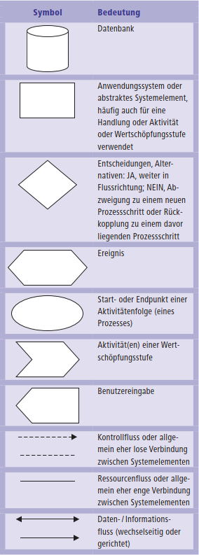

# Mitschrift Kapitel 1

# Nutzungsweise des Buches

- Grundverständnis Informationssysteme sindsoziotechnische Systeme
- Betrachten von vielen Perspektiven verschiedener Disziplinen
- Alle Kapitel sind modular gekapselt, es gibt Übungen und Fallstudien
- Folgende genutze Symbole haben diese Bedeutungen:

---

# Teil 1 - Vernetzte Unternehmenswelt (Kapitel 1-4)

- Informationssysteme
- Wirtschaftsinformatik
- Informationssysteme: Strategie Organisation der Wertschöpfung,
- Ethische & soziale & politische Fragen
- **Überblick über nachhaltige IT-Trends zum vernetzten Unternehmen, also Unternehmen, die alle Geschäftsprozesse, betriebswirtschaftlichen Funktionsbereiche, Beziehungen im und aus dem Unternehmen durch Informations und Kommunikationssysteme abbilden.**

## Teil 1 - Kapitel 1 Informationssysteme

- Entscheidungsträger müssen wissen wie Informationssysteme Wettbewerbsfähigkeit, Effizient und Rentabilität steigern können.

<!-- TODO Fragestellungen beantworten -->

**Fragestellungen**:

- Welche Rolle spielen Informationssysteme im heutigen von Wettbewerb geprägten betrieblichen Umfeld?
- Was versteht man unter einem Informationssystem? Wa smüssen Führungskräfte über diese wissen?
- Was versteht man uinter einem Anwendungsystem? Was ist der Unterschied zum Informationssystem?
- In welcher Hinsicht haben das Internet und Informationstechnik Unternehmen und öffentliche Institutionen verändert?
- Welches sind die wichtigsten Probleme die das Management eines Unternehmens beim Aufbau und Einsatz von Informationssystemen bewältigen muss?

### Einführende Fallstudie

- Unternehmen das Holzernte durch Informationssysteme steigert
- Unternehmen Ponsse ist Marktführer für Kurzholzerntemaschinen
- Bietet den Kunden neben Traktoren, Kränen etc auch ein Informationssystem als Paket an um Prozessabläufe der Kunden zu helfen und Informationen zu erhalten
- Bedarfsberechnung für Holzarten und Holzlänge, Einschlagplan für Bäume erstellen, Abholzertrag berechnen mit historischen Datensätzen, Kartensysteme für Bediener von Maschinen, E-Mailsysteme, Schneidepunktberechnungen, Routenberechnung für LKWs, Simulationstraining für Lernende der Geräte
- Informationssysteme verbinden alle Beteiligten wie Waldbesitzer, Holzeinkäufer, Maschinenbesitzer und Fahrer und andere Unternehmen miteinander
- System funktioniert gut und schafft Nutzen für alle.
- Einige Systeme sind in Maschinen eingebaut, andere sind eigenständige Produkte

### Sinn und Zweck von Informationssystemen

- Informationssysteme und Wissen ist für alle Mitarbeiter nötig für Profibitalität
- Entfernte Standorte können durch Informationssysteme erreicht werden, neue Produkte angeboten, Geschäftsprozesse und Geschäfte neu erschlossen werden
- Es gibt 4 Veränderungen des betrieblichen Umfelds:

  - **Entstehung globaler Wirtschaft**

    - Wettbewerb von Weltmärkten, Wirtschaft ist von Export & Import abhängig. Arbeit wird dahin verlagert wo sie am günstigsten ausgeführt werden kann.
    - Management und Kontrole im globalen Markt durch Informationssysteme die rund um die Uhr arbeiten und koordinieren

  - **Wandel von Industriegesellschaft zu Informationsbasierter Dienstleistungsgesellschaft**

    - Produktionen werden in Billigländer verlagert, Wissen und Wertschöpfung entsteht hier und trägt zur Wertschöpfung bei
    - Arbeiterzahlen im produzierenden Gewerbe sinken, Dienstleisterarbeitszahlen steigen
    - Dienstleistungen können Vertrieb, Bildung, Banken, Versicherung, Recht, Beratung von Unternehmen oder Programmieren sein
    - In solchen Unternehmen besteht der Großteil des Marktwertes aus immateriellen Vermögenswerten wie eigenem Wissen, Geschäftsmethoden. Physische Wert wie Maschinen, Gebäude etc machen weniger als 20% aus.
    - Informationstechnik (IT) ist ein Oberbegriff für Informations- Datenverarbeitung und Kommunikation. Technik ist die Umsetzung von Wissen und Technologien.

  - **Wandel der Unternehmen selbst**

    - Strukturen und Führung sind im stetigen Wandel
    - Traditionelle Form ist eine hierarchische zentralisierte Organistion von Spezialisten mit festen Regeln die ein massenfertigbares Produkt/Dienstleistung erschaffen
    - Moderene Unternehmen habe flache, dezentralisierte und flexible Organisationen von Generalisten die sofort verfügbare Daten für Erzeugung von massenfertigbaren Produkten/Dienstleistungen nutzen
    - Oft werden heute zugeschnittenere und individueller Produkte erstellt, gleichgeformte Massenfertigung wird immer weniger
    - Management ist weiterhin in festen Plänen und verlässt sichauf informelle Zusagen statt formele Planung um Ziele durch Projektarbeiten zu erreichen
    - Modernes Management wird durch Lernfähigkeit von Mitarbeitern für Entscheidungen und durch Informationssysteme ermöglicht

* **Vernetztes Unternehmen**

  - Vollkommen (IT)vernetzte Unternehmen wurden geschaffen, welche alle Geschäftsprozesse, betriebswirtschaftliche Funktionen, Beziehungen im Unternehmen und zu Kunden/Lieferanten/Markt durch Informationssysteme unterstützen
  - Ein Geschäftsprozess ist eine Folge logisch koheränter Aktivitäten um Wertschöpfung zu betreiben mit definierten Anfang und Ende. Wird wiederholt ausgeführt und ist oft kundenorientiert
  - Geschäftsprozesse können Produktentwicklung, Auftragsbearbeitung oder Einstellung eines Mitarbeiters sein und setzen Material, Information oder Wissenflüsse voraus
  - Immaterielle Vermögenswerte wie geistiges Eigentum, Kompetenzen, finanzielle und personelle Ressourcen werden elektronisch verwaltet und alle Infos sind sofortig abrufbar
  - Vernetzte Unternehmen sind flexibler und können schlechtere Zeiten adaptischer erschließen als traditionelle Unternehmen
  - IT ist für die Führung ein essentielles Managementtool und manche Unternehmen wie Cisco sind vollkommen vernetzte Unternehmen wo alles am Internet hängt

#### Strategische Geschäftsziele von Informationssystemen

- Es wird heute sehr viel in Informationssysteme investiert da diese für das Tagesgeschäft enorm wichtig sind und nur mit diesen strategische Ziele erreicht werden
- E-Commerce wie Amazon, Ebay, Google, Zalando würden nicht existieren, sowie auch Banken, Versicherungen oder Reiseunternehmen oder Verkaufsketten wie Aldi und Lidl oder Autohersteller würden nur in begrenzter Form existieren
- Was ein Unternehmen in 5 Jahren erreichen kann hängt oft von heutigen Systemen ab, Geschäftsstrategien und Einsatz von IT ist oft sehr abhängig
- Betriebe möchten mit IT 6 Ziele erreichen:

  - **Exzellente Betriebsabläufe**

    - Geschäftsprozesse kontinuierlich verbessern für höheren Grad der Effektivität und höher Effizienz also Aufwands/Ertragsverhältnis
    - Wal-Markt nutzt IT-System um jeden Zuliefer mit jeder Filiale zu vernetzt und in Echtzeit über Kauf jeden Artikels informiert wird und nachliefern kann

  - **Neue Produkte, Dienstleistungen und Geschäftsmodelle**

    - Ein Geschäftsmodell beschreibt wie ein Unternehmen ein Produkt/Dienstleistung erstellt, bereitstellt und vertreibt und Gewinn zu erhalten
    - Netflix hat Videotheken durch Onlinedistribution und Streaming abgelöst und neue Dienstleistungsmöglichkeiten geschaffen da alle Titel immer verfügbar und abrufbar sind

  - **Kunden/Lieferantennähe**

    - Wenn Unternehmen Kunden/Lieferantenwünsche gut erfüllen kommen diese wieder was Umsatz und Gewinn steigert
    - Je mehr Lieferanten genutzt werden desto mehr können diese Kosten senken
    - Kundenwünsche sind schwer erfassbar Hotels nutzen IT um beliebte Raumtemperatur, Ankunftszeiten, Rufnummernutzungen, Fernsehprogramme etc zu erkennen und Kundneprofile klassifiziert

  - **Optimierte Entscheidungen**

    - Viele Manager nutzen Schätzungen, Prognosen und Intuition da Informationen nicht im Unfang oder rechtzeitig vorliegen wodurch unter- oder überproduziert wird und Gewinn verloren geht und Kunden verschwinden da zu langsam reagiert wird
    - Durch IT können Manager Echtzeit-Daten nutzen für Entscheidungen wie für aktuelle Kundenbeschwerden oder Leitungsschäden im Netzwerk und Reperaturteams gezielter beauftragt werden können

  - **Wettbewerbsvorteile**

    - Bereits das Erreichen eines Zieles führt zu Wettbewerbsvorteilen und erlangen von Gewinnen das anderen Unternehmen verwehrt bleibt

  - **Fortbestand des Unternehmens**

    - Investitionen in IT wird auch für für den Fortbestand von Geschäftsmodellen nötig wie die Einführung von Geldautomaten für mehr Kundenservice alle Banken zur Investition zwang, was heute Notwendigkeit zum betreiben einer Bank ist
    - Auch schreiben Regulatoriken die Verwahrung von Daten mit gewissen Technologien vor (IT-Compliance/Datenschutz)

#### Anwendungensysteme von Informationssysteme

- Ein **Anwendungssystem** beinhaltet alle Programme für konkretes betriebliches Anwendungsgebiet zur Entwicklung, Einführung und Einsetzung, sowie Datenbanken für Datenvernetzung zur Software und Infrastruktur auf der die Software läuft
- Anwendungsysteme sind oftmals viele zweckgebundene wie für Rechnungswesen, Personalwesen, Logistik, Verkauf, Marketing etc
- Anwendungssystem ist die technische Realisation eines Informationssystem mittels Hard/Software und Daten
- Oftmals werden Softwaresysteme eingekauft und müssen dennoch an Prozesse angepasst werden
- Ein **Informationssystem** ist für betriebsliche Aufgaben geschaffen und enhält die Anwendungssoftware, sowie die Daten aber auch die Organisationsstruktur und das Personal
- Informationssysteme sind immer betriebsindividuell und können nur so zugeschnitten die volle Wirkung entfachen und können nicht einfach fertig eingekauft werden
- Trennung zwischen Informations und Anwendungsystem ist schwammig
- **Informationen** sind Daten die für Menschen Bedeutung und sinnvolle Form ahben (Auswertungen aus Verkaufszahlen)
- **Daten** sind rohee Fakten und nicht für Menschen strukturiert (Preise, Artikelnummern)
